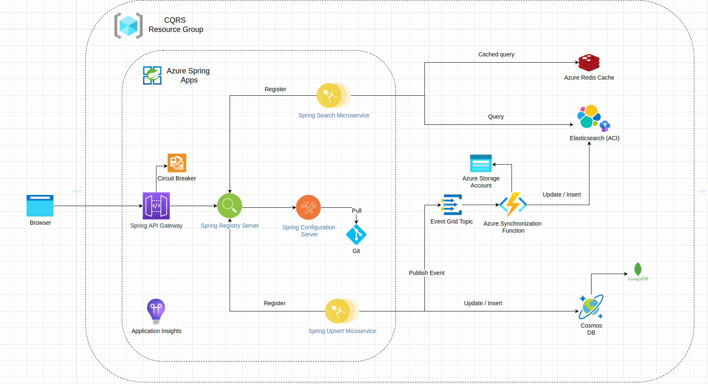

## Overview

This is a Proof of concept of a CQRS implementation using Azure Services.

This is an improvement over [this project](https://github.com/Saief1999/cqrs-microservices), the different components have been deployed on Azure using the relevant services.

## Technical Overview

This is the full architecture :



Full presentation can be found here : [Presentation link](https://docs.google.com/presentation/d/1dFtx48FfI9SLz0w9gUmCfHPFU4FizrWqacQEvBQa6wg/edit?usp=sharing)


Reads are happening through `Elasticsearch`, Writes happen through `CosmosDB`. Synchronization is done using an `Azure function` that subscribes to an `Event Grid Topic`.

The whole architecture is deployed using `Terraform`.

We used `Azure Spring Apps` to deploy the different microservices.

We used a `Redis cache` to cache Responses from Elasticsearch for even faster queries.

We used `Application Insights` Both in the `Azure function` and `Spring apps service` to monitor the state of our set of applications.

The `Configuration Server` and the `Registry Server` are automatically provided by Azure. We just configured the configuration server to point to the appropriate git repository. You can find the configuration server repository [here](https://github.com/Saief1999/cqrs-config-repo) .

## Quickstart

1. Create terraform infrastructure by running `terraform apply` under `/infrastructure`.

2. deploy the azure function ( after building it with `npm run build` in `/function-app` ).

3. Create the event subscription in the terraform code, to link the azure function to event grid.

4. change  Eventgrid endpoint + Token and cosmos connection string in the config server (on github) to match the new ones ( you can find values in the terraform output ).

5. in each of the services ( search, upsert, gateway ), we package them again : 

```bash
./mvnw clean package -DskipTests
```

6. We deploy them on Azure spring Apps :

```bash
az spring app deploy     --resource-group dev-cqrs-rg     --service dev-cqrs-springcloud     --name search-microservice     --artifact-path target/search-microservice-0.0.1-SNAPSHOT.jar --deployment default
```

```bash
az spring app deploy     --resource-group dev-cqrs-rg     --service dev-cqrs-springcloud     --name upsert-microservice     --artifact-path target/upsert-microservice-0.0.1-SNAPSHOT.jar --deployment default
```

```bash
az spring app deploy     --resource-group dev-cqrs-rg     --service dev-cqrs-springcloud     --name gateway-service    --artifact-path target/gateway-service-0.0.1-SNAPSHOT.jar --deployment default
```

## Possible Improvements

- The provisioning is done by Terraform. However some configuration is still not automated ( Updating the different uris/endpoints in the config server, Bundling/Deploying the Azure functions & the different spring boot applications ). For this we can create a CICD pipeline to automate the process.

- The configuration server secrets should be secured more in a real setup. For that we can use `Azure Keyvault` as a **backend** for our `spring configuration server`.

- The microservices lack proper `unit tests` which is very important in a real setup. In this simple example this wasn't necessary.